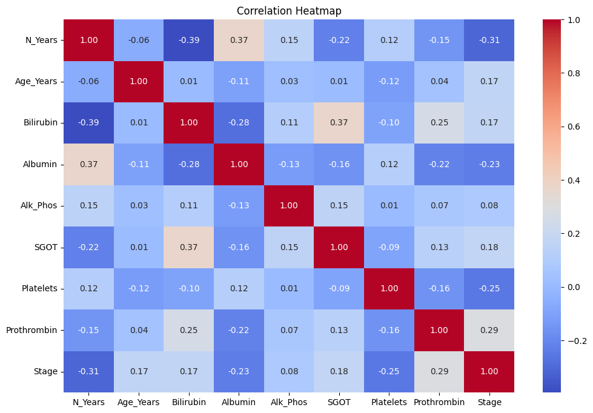
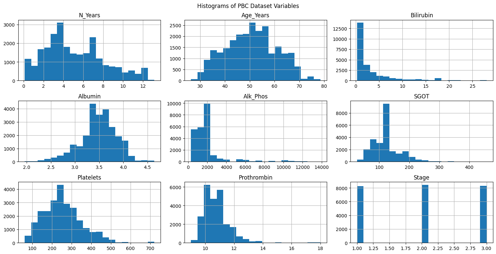
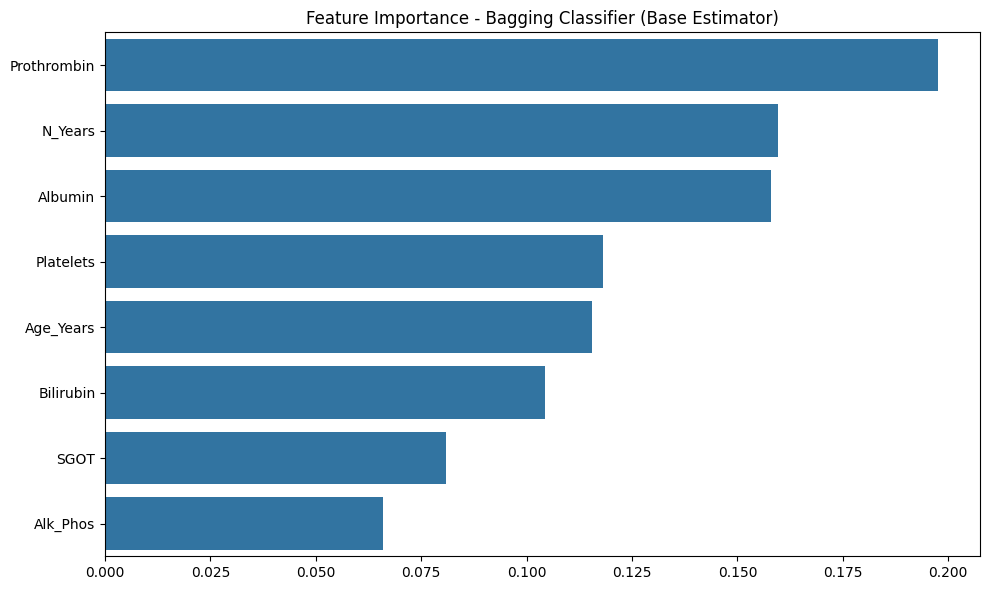
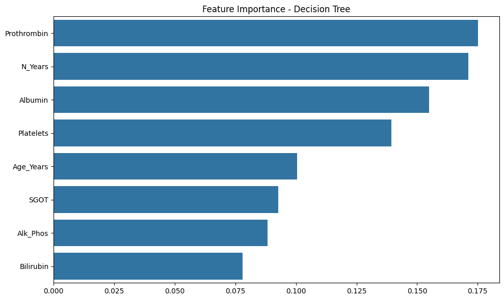
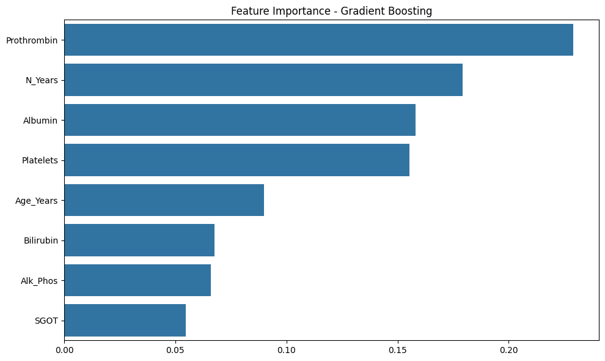
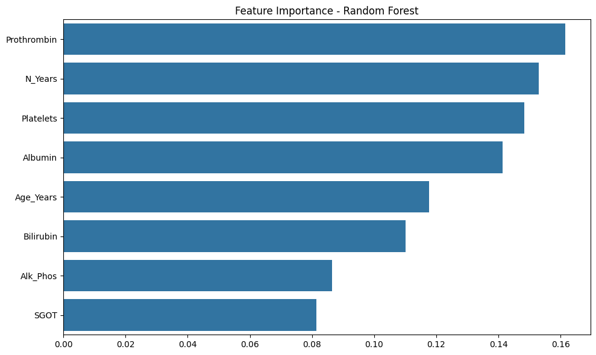
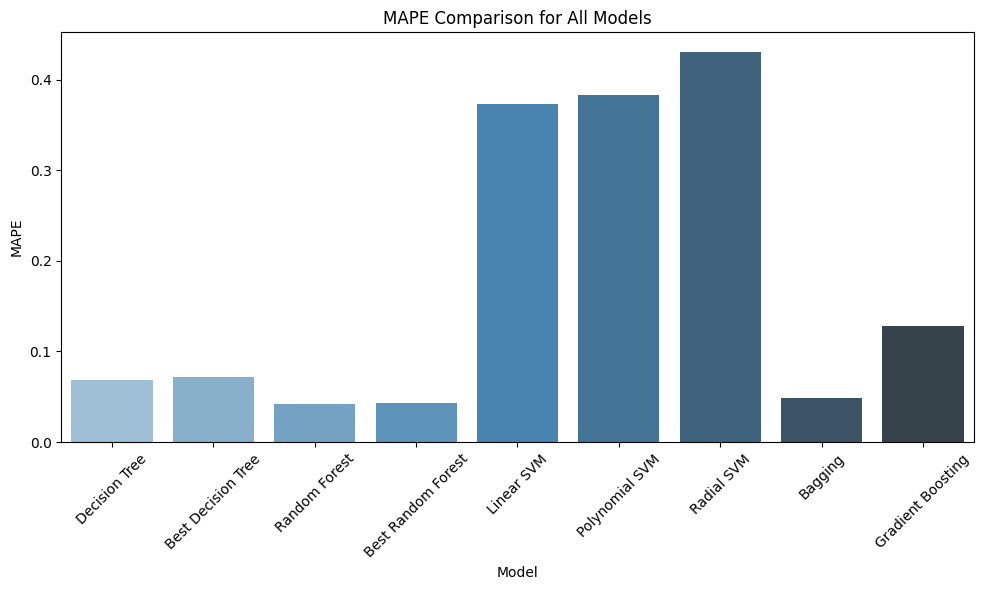
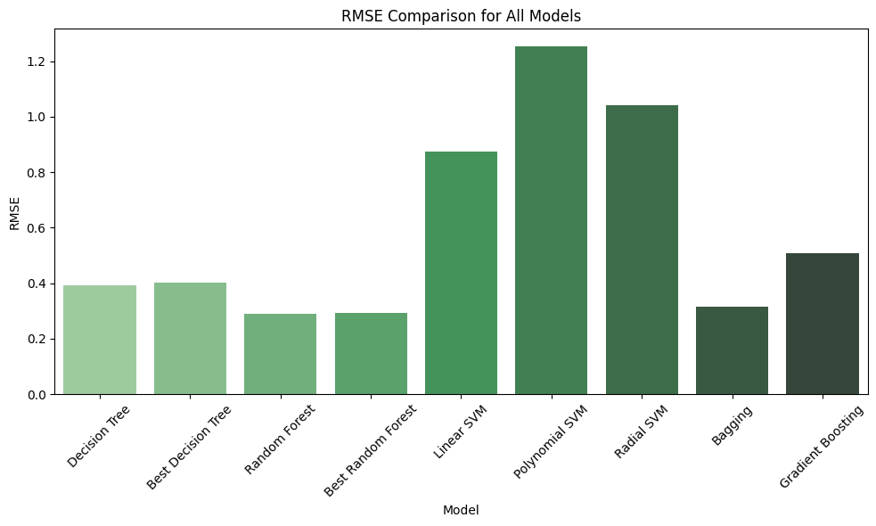

# AWS-Assignment
# Leveraging Machine Learning and Predictive Analytics in Healthcare: Classification Modeling for Liver Cirrhosis Staging

## 1. Project Overview
This project explores the use of machine learning models to predict liver cirrhosis stages using clinical and biochemical data. We used multiple machine learning algorithms, including Decision Trees, Random Forest, SVM, Bagging, and Gradient Boosting, to enhance early diagnosis and treatment.

## 2. Objective
The primary objective is to accurately predict liver cirrhosis stages using clinical data. This can aid healthcare professionals in non-invasive diagnosis and treatment planning, ultimately improving patient outcomes.

## 3. Dataset
The dataset was obtained from [Kaggle Liver Cirrhosis Stage Classification](https://www.kaggle.com/datasets/aadarshvelu/liver-cirrhosis-stage-classification/data) and includes features like:
- Bilirubin
- Albumin
- Prothrombin time
- Platelet count

## 4. Methodology

### 4.1 Data Collection & Preprocessing
- Handled missing values using median imputation.
- Applied normalization for features with high variance.
- Encoded categorical variables like `sex` and `ascites`.

### 4.2 Exploratory Data Analysis
We conducted an in-depth exploratory analysis to understand the relationships between the variables.
- **Heatmap of Correlations**: 
  
- **Histograms of Dataset Variables**: 
  

### 4.3 Model Building
- Implemented multiple models: Decision Trees, Random Forest, SVM, Bagging, and Gradient Boosting.
- Hyperparameter tuning was performed using `GridSearchCV` and `RandomizedSearchCV` to optimize each model's performance.

### 4.4 Feature Importance Analysis
We analyzed the importance of features using various models. Below are the feature importance charts for each model:
- **Feature Importance - Bagging Classifier**:
  

- **Feature Importance - Decision Tree**:
  

- **Feature Importance - Gradient Boosting**:
  

- **Feature Importance - Random Forest**:
  

### 4.5 Model Evaluation
The models were evaluated based on Mean Absolute Percentage Error (MAPE) and Root Mean Squared Error (RMSE). The following graphs show the performance of the models:

- **MAPE Comparison for All Models**:
  

- **RMSE Comparison for All Models**:
  

## 5. Tools and Technologies
- **Programming Languages**: Python (Pandas, Scikit-learn, NumPy, Matplotlib, Seaborn)
- **IDE**: Jupyter Notebook
- **Data Source**: Kaggle Liver Cirrhosis Stage Classification Dataset

## 6. Results and Key Insights
- Random Forest and Bagging models outperformed the others, achieving the lowest error rates.
- Feature importance analysis highlighted **prothrombin time** and **age** as key predictors.

## 7. Code Link: 
[Collaborate on Google Docs](https://colab.research.google.com/drive/1xS2zanCrZIFQozuomvjAZxVGZdUM0Okb?usp=sharing)

## 8. Conclusion
The project demonstrates how machine learning can be used to predict liver cirrhosis stages accurately. By utilizing Random Forest and Bagging models, we achieved high accuracy, making this methodology applicable in clinical diagnostics.

